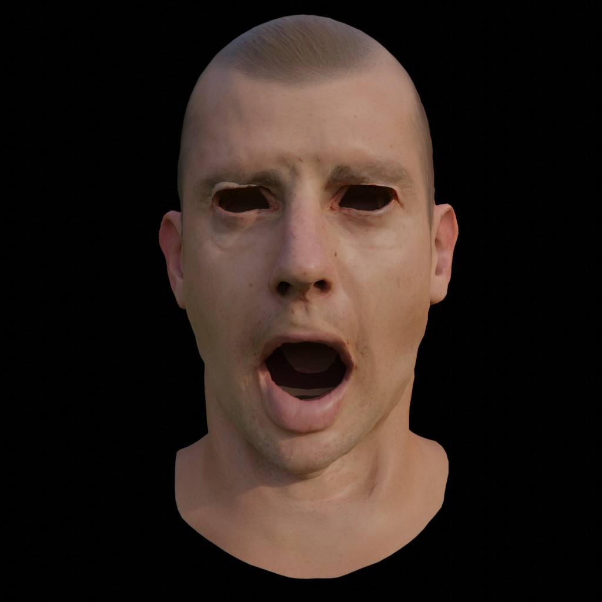
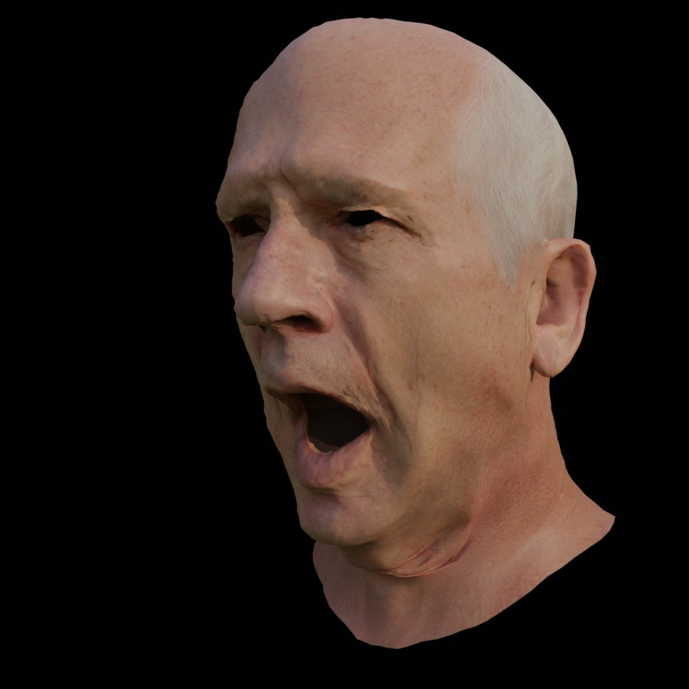

# Non-Linear 3D Morphable Models

Creation of state-of-the-art digital avatars, for the past two decades, have been facilitated by data acquired via a polarized spherical gradient illumination scanning system (a.k.a lightstage) aided by the photometric stereo algorithm. While this highly constrained data capture setup provides accurate estimation of various human skin reflectance components, it is expensive on the cost and time axis.

Since Blanz and Vetter’s seminal work, the community has focused on building data-driven parametric models for face geometry and appearance. Previous research focused on linear models specifically building bilinear and multilinear models with a linear subspace, assuming a Gaussian prior distribution. While these models have become widely popular in the computer vision and machine learning community for applications like Deepfakes, their limitations have prohibited adoption by graphics practitioners. 

Motivated by recent works on non-linear face models, we built a deep generative face model operating on vertex-based deformation representation. Our method enjoys properties like disentangled identity and expression latent space, models correlation between appearance and geometry and captures high-frequency textures, and importantly provides artistic semantic control. The result allow users to synthesise random realistic human faces and explore the manifold of faces by performing latent space manipulation akin to works like StyleGAN in the 2D domain.


  

## Requirements

- PyTorch
- CUDA

Optional
- Blender

*Tested on Ubuntu 18, CUDA.__version__==10.2, pytorch.__version__==1.10.1*

## Installation

First, install `conda` : https://docs.conda.io/projects/conda/en/latest/user-guide/install/linux.html

Then run the following commands:
````
conda env create -f environment.yaml
conda activate nonlinear3dmm
````

*Optional*

Source: https://github.com/ThibaultGROUEIX/AtlasNet

````
python auxiliary/ChamferDistancePytorch/chamfer3D/setup.py install #MIT
cd auxiliary
git clone https://github.com/ThibaultGROUEIX/metro_sources.git
cd metro_sources; python setup.py --build # build metro distance #GPL3
cd ../..
````


## Usage

**Train**:

````
python train.py config/<choose a config file>

````

**Test**:

Make sure the right model evaluation mode is set in the config file and then run the below.

````
python generate.py config/<choose a config file>

````

## Results


